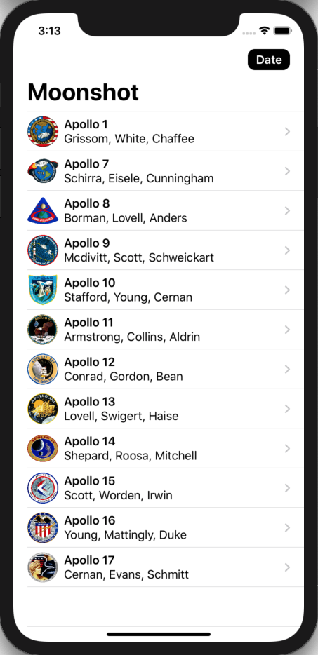

# 100 Days of SwiftUI Project 9

## Moonshot

**App Description:**  Presents Apollo mission and related Astronaut data.

**Swift Features Used:**
GeometryReader, ScrollView, NavigationLink, Codable, Generics, LayoutPriority.

**Screenshots:**

